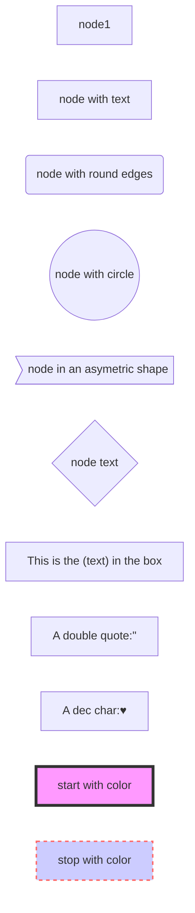

####  流程图
##### 1. 各种点的画法

| 表述         | 说明           |
| ------------ | -------------- |
| `id[文字]`   | 矩形节点       |
| `id(文字)`   | 圆角矩形节点   |
| `id((文字))` | 圆形节点       |
| `id>文字]`   | 右向旗帜状节点 |
| `id{文字}`   | 菱形节点       |



##### 2. 各种连线的画法
| 表述       | 说明           |
| ---------- | -------------- |
| `>`        | 添加尾部箭头   |
| `-`        | 不添加尾部箭头 |
| `--`       | 单线           |
| `--text--` | 单线上加文字   |
| `==`       | 粗线           |
| `==text==` | 粗线加文字     |
| `-.-`      | 虚线           |
| `-.text.-` | 虚线加文字     |


##### 3. 连线方向
| 表述       | 说明           |
| ---------- | -------------- |
| TB      | top bottom 上到下   |
| BT      | bottom top 下到上   |
| LR      | left right 左到右   |
| RL      | right left 右到左  |
| TD      | top down 上到下   |


##### 4. 子图和提示

#### 时序图
1. 各种例子

| Type | Description                                 |
| ---- | ------------------------------------------- |
| ->   | 实线 没有箭头                   |
| -->  | 虚线 没有箭头                |
| ->>  | 实线 有箭头                  |
| -->> | 虚线 有箭头                  |
| -x   |  实线 箭头 叉号 |
| --x  | 虚线 箭头 叉号 |

```mermaid

sequenceDiagram

    participant A as  Alice
    participant J as  John
    A->>J: Hello John, how are you?
    J->>A: Great!
    A -> J: 实线 没有箭头
    A --> J:虚线 没有箭头
    A ->> J:实线 有箭头
    A -->> J:虚线 有箭头
    A -X J: 实线 箭头 叉号
    A --X J: 虚线 箭头 叉号


    A->>J: Hello John, how are you?(激活 John)
    activate J
    J-->>A: Great! (不激活 Alice)
    deactivate A
    A->>+J: Hello John, how are you?
    J-->>-A : Great!


    A->>+J: Hello John, how are you?
    A->>+J: John, can you hear me?
    A->>+J: John, can you hear me?
    J-->>-A: Hi Alice, I can hear you!
    J-->>-A: Hi Alice, I can hear you!
    J-->>-A: I feel great!

    Note right of A: Text in note
    Note left of A: Text in note
    Note RIGHT of J: Text in note
    Note left of J: Text in note
    Note over A,J: A typical interaction

    loop Every minute
        Note right of J: 循环里边继续提示
        Note right of A: 提示
        Note over A,J: 循环里边提示
        A --> J: Great!
        A -> A : 自己循环
    end

     A->>Bob: Hello Bob, how are you?
    alt is sick
        Bob->>A: Not so good :(
    else is well
        Bob->>A: Feeling fresh like a daisy
    end
    opt Extra response
        Bob->>A: Thanks for asking
    end
```


##### 甘特图
