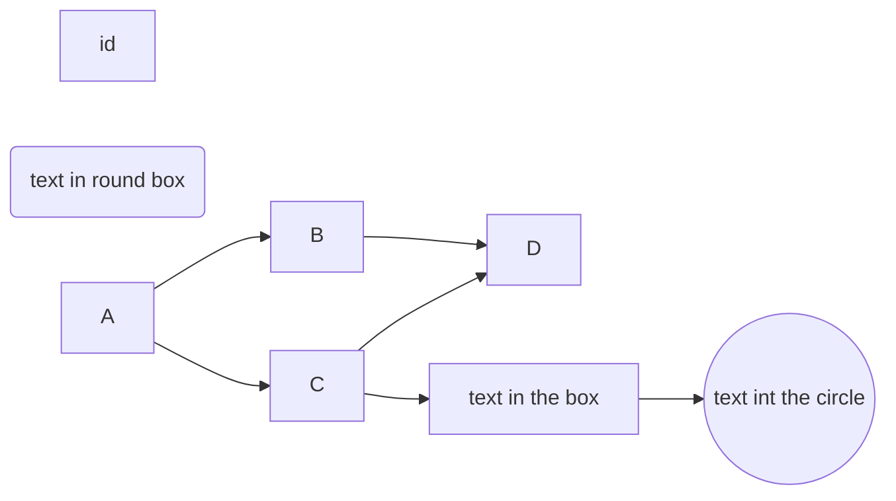
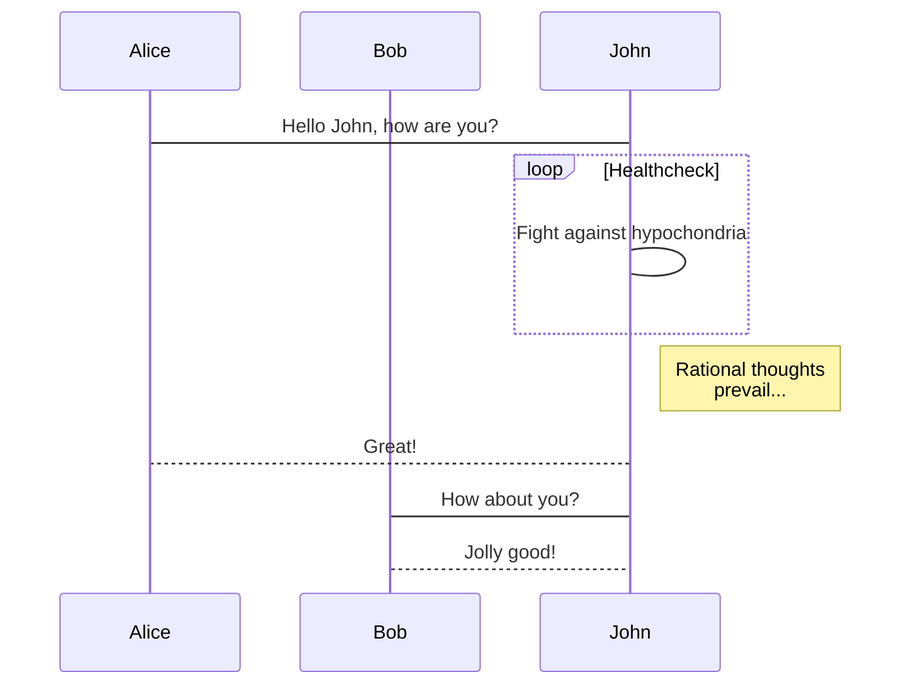
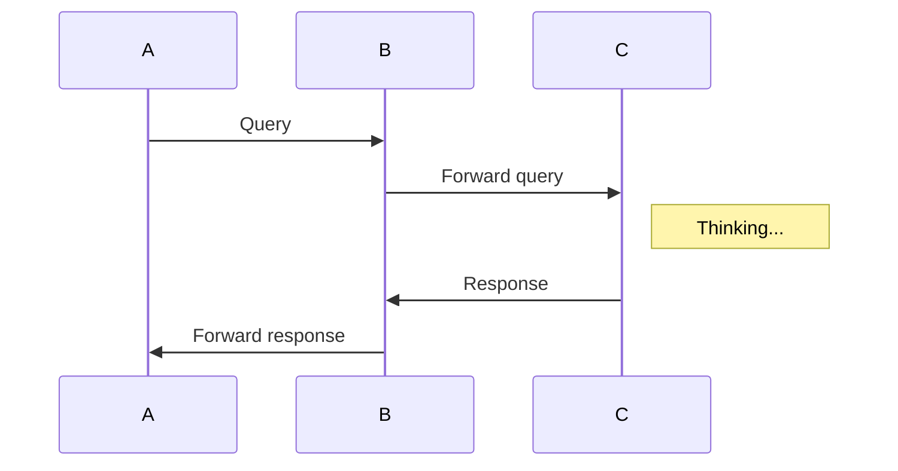
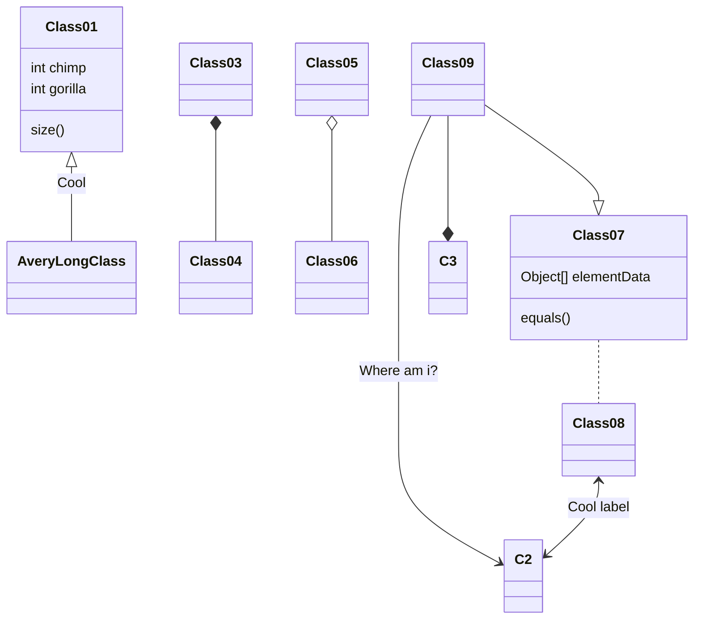
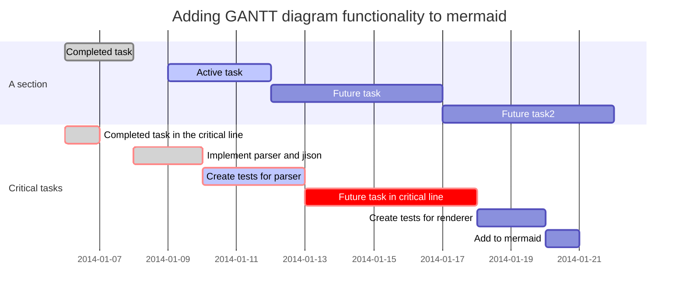
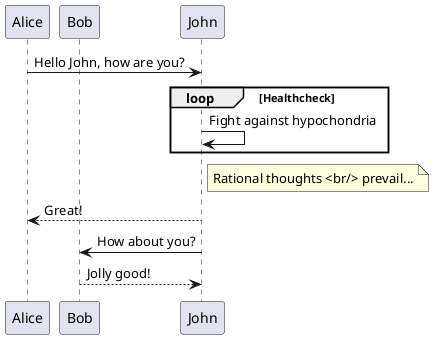
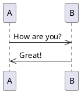
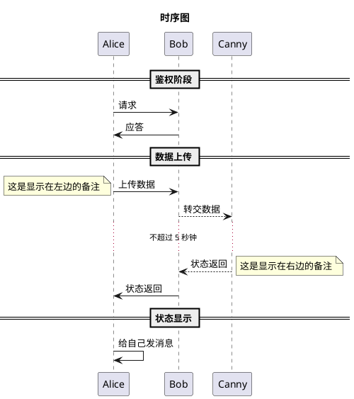
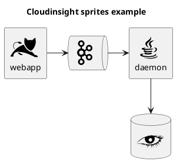
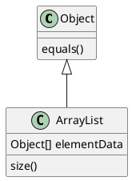

##### VS Code设置Markdown支持流程图、时序图等

1. VSCode选择左侧 Extensions面板，搜索Markdown Preivew Enhanced，安装

2. 插件以及markdown的一些语法，参考[插件文档](<https://shd101wyy.github.io/markdown-preview-enhanced/#/zh-cn/>)

3. Ctrl+Shift+P 搜索settings，选择Preferences:Open Settings(JSON)，打开设置文件

4. 添加json字段，修复 mermaid图是黑框的问题

   ```json
   "markdown-preview-enhanced.mermaidTheme": "forest"
   ```

   

5. ~~plantuml不能执行问题~~ 
    ~~"plantuml.commandArgs": [
       "-DGRAPHVIZ_DOT=\"D:/Users/Nonghorn/Personal App/graphviz/bin/dot.exe\"",
   ]~~

6. plantuml不能执行问题

   ```
   安装 graphviz（参看下边的下载地址）
   添加环境变量 （路径为你的安装路径）
   DGRAPHVIZ_DOT  D:/Users/Nonghorn/Personal App/graphviz/bin/dot.exe
   ```

   

7. [Graphviz下载地址](<https://graphviz.gitlab.io/_pages/Download/Download_windows.html>)

8. 导出PDF，需要安装 princexml ，将C:\Program Files (x86)\Prince\engine\bin加入path环境变量

9. [prince下载地址](<https://www.princexml.com/download/>)

10. 导出PDF，有两种方式 一种是上边的，另外一种是使用chrome的预览功能。（prince导出时，有图片会需要下载其他东西，导出后有标题书签。chrome导出后图片正常，没有标题书签）


##### Demo











```sequence {{theme="hand"}}
A->>B: How are you?
B->>A: Great!
```








